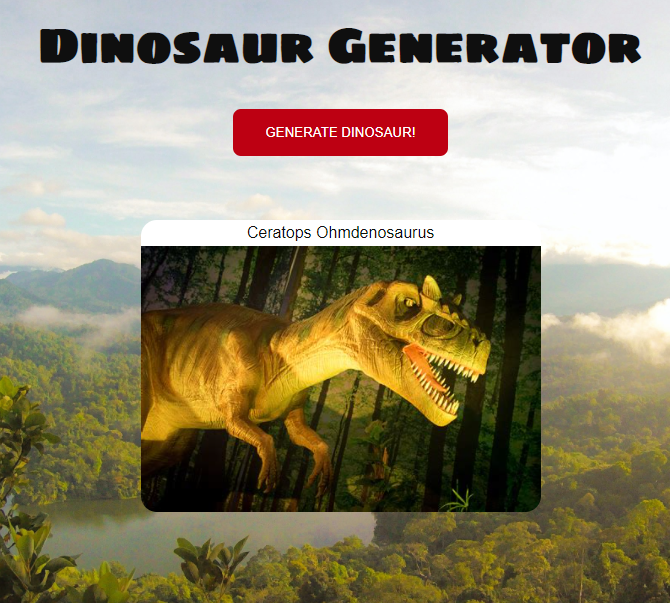

This is a codealong from Coder Coder (Jess Chan), called "Building a Node.js app". The video tutorial is available online at: https://youtu.be/wYALykLb5oY

#### SETUP

If you clone this code to your local repository, you will need to create your own .env file in the root directory and add:
`API_KEY=xxxxxxxx`
xxxxxx represents your Rapid API key. If you do not have one, you may join Rapid API online to get an API_KEY: https://rapidapi.com/

#### NOTES
`$ npm init`

In package.json, under scripts, set up nodemon for development (this will automatically restart your server everytime you make a change to the code) with access point index.js:

`"dev": "nodemon index.js`

`$ npm install express`

`$ npm install nodemon --save-dev`

Run server and open http://localhost:3000/ in browser:
`$ npm run dev`